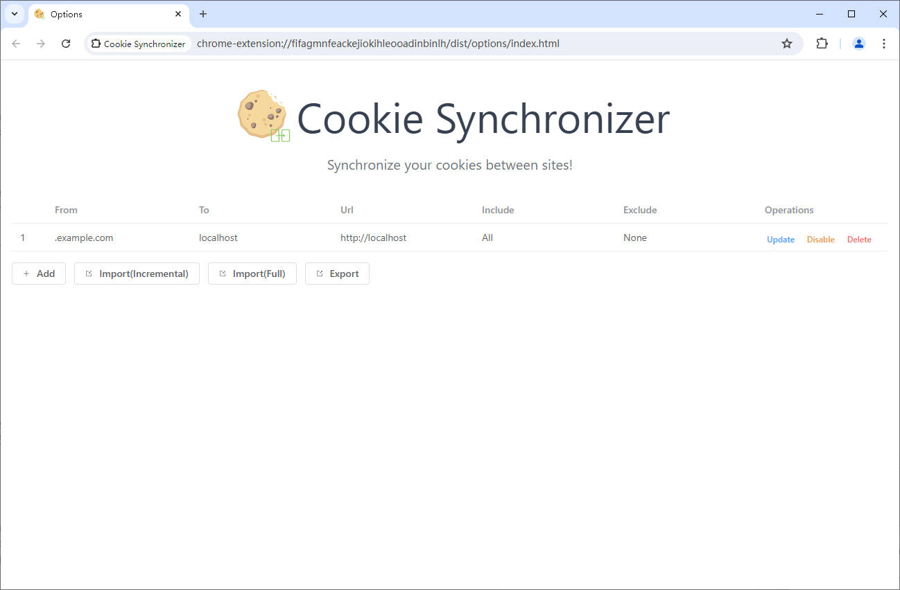

# Cookie Synchronizer

Synchronize your cookies between sites!

<p align="center">
<br/>
<sub>Options Page</sub><br/>
</p>

## Use the Extension

### Clone to local

If you prefer to do it manually with the cleaner git history

> If you don't have pnpm installed, run: npm install -g pnpm

```bash
npx degit ac-0308/cookie-synchronizer
cd cookie-synchronizer
pnpm i
```

## Usage

### Folders

- `src` - main source.
  - `contentScript` - scripts and components to be injected as `content_script`
  - `background` - scripts for background.
  - `components` - auto-imported Vue components that are shared in popup and options page.
  - `styles` - styles shared in popup and options page
  - `assets` - assets used in Vue components
  - `manifest.ts` - manifest for the extension.
- `extension` - extension package root.
  - `assets` - static assets (mainly for `manifest.json`).
  - `dist` - built files, also serve stub entry for Vite on development.
- `scripts` - development and bundling helper scripts.

### Build

To build the extension, run

```bash
pnpm build
```

And then pack files under `extension`, you can switch on the developer mode and add unzipped extension into you browser.

## Credits

This extension is based on [vitesse-webext
](https://github.com/antfu-collective/vitesse-webext) ,A Vite powered WebExtension (Chrome, FireFox, etc.) starter template.
